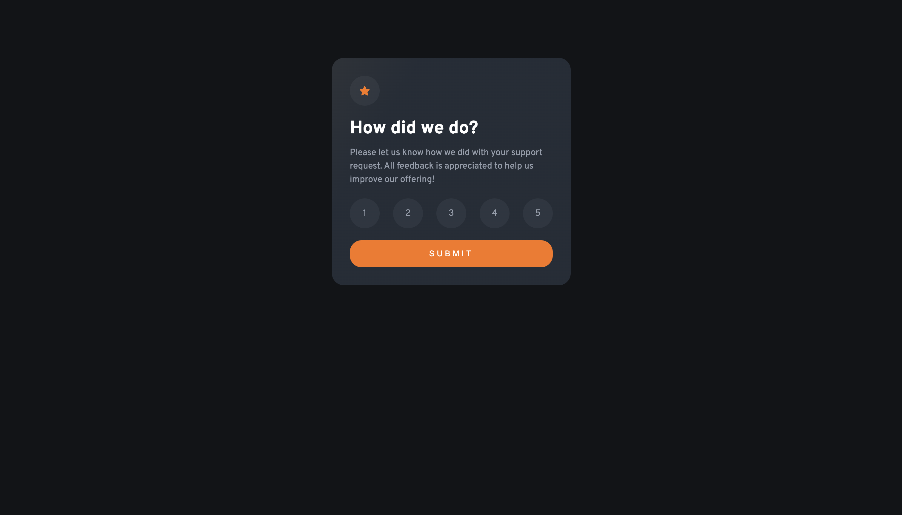

# Frontend Mentor - Interactive rating component solution

This is a solution to the [Interactive rating component challenge on Frontend Mentor](https://www.frontendmentor.io/challenges/interactive-rating-component-koxpeBUmI). Frontend Mentor challenges help you improve your coding skills by building realistic projects.

## Table of contents

- [Overview](#overview)
  - [The challenge](#the-challenge)
  - [Screenshot](#screenshot)
  - [Links](#links)
- [My process](#my-process)
  - [Built with](#built-with)
  - [What I learned](#what-i-learned)
  - [Continued development](#continued-development)
- [Author](#author)

## Overview

### The challenge

Users should be able to:

- View the optimal layout for the app depending on their device's screen size
- See hover states for all interactive elements on the page
- Select and submit a number rating
- See the "Thank you" card state after submitting a rating

### Screenshot



### Links

- Solution URL: [Add solution URL here](https://your-solution-url.com)
- Live Site URL: [Add live site URL here](https://your-live-site-url.com)

## My process

### Built with

- Semantic HTML5 markup
- CSS custom properties
- Flexbox
- CSS Grid
- Javascript

### What I learned

I learned how to position elements on the screen based on the flexbox layout that I want. I also used Javascript for adding custom styles for the classes when listening to events. I really liked how easy it was using loops:

```js
for (let index = 0; index < options.length; index++) {
  options[index].addEventListener("click", () => {
    clearAll();
    selectedOption = index;
    options[index].classList.replace(
      "rating__scale--option--selectable",
      "rating__scale--option--active"
    );
  });
}
```

### Continued development

I am not totally comfortable with responsive styling. So that is an area that I want to improve on future challenges.

## Author

- Github - [guillermoSb](https://www.your-site.com)
- Frontend Mentor - [@guillermoSb](https://github.com/guillermoSb/frontend-challenges)
- Twitter - [@dev_guille](https://www.twitter.com/dev_guille)
